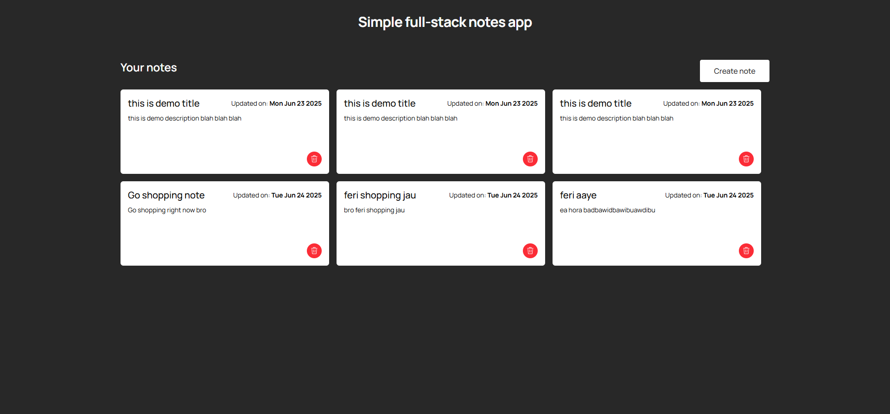
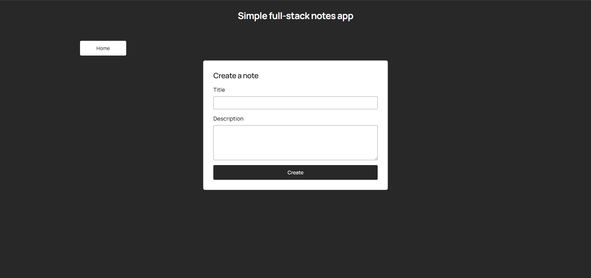

# 🗒️Fullstack Notes App

This is a simple fullstack notes app made using  **React** for frontend and  **Express** for backend with **MongoDB** for database.

## 🚀Features
- User can view notes.
- User can create notes.
- User can delete notes.


### How to run 
#### Backend
  **1.** Navigate to backend directory

```
cd backend
```

  
  **2.** Install dependencies
  
```
npm install
```
  
  **3.** Create an env file and add environment variables

  
```
MONGODB_URI=""
PORT=""
FRONTEND_URL=""
```
  
  **4.** Start the server
  
```
npm run dev
```
#### Frontend
  **1.** Navigate to frontend directory

```
cd frontend
```

  
  **2.** Install dependencies
  
```
npm install
```
  
  **3.** Start the server
  
```
npm run dev
```

### Screenshots
#### User notes


#### Create note form

